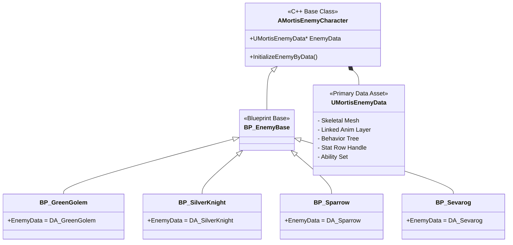
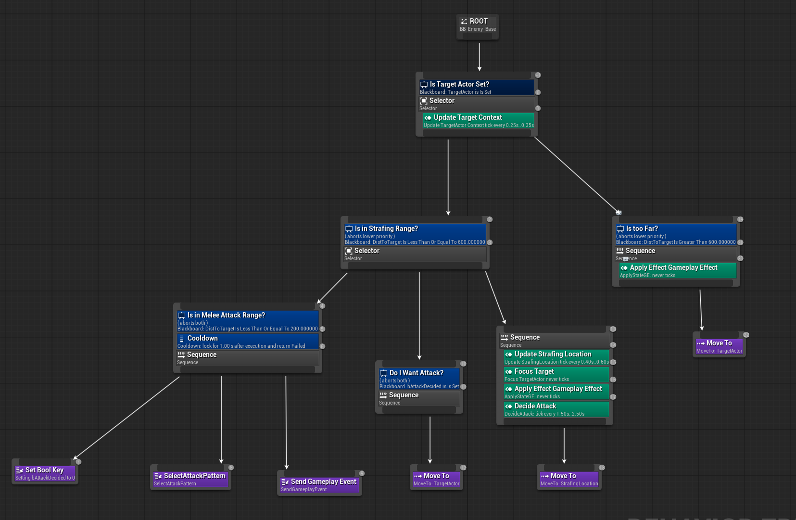
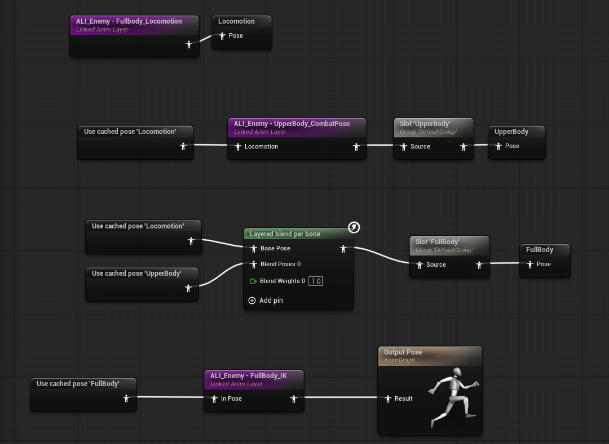

# EternalMortis — Enemy / Combat / Animation / Spawn 아키텍처

소울라이크 + 로그라이크 3D 액션 게임 **EternalMortis**에서 제가 설계·구현한 C++ 시스템 소스 코드입니다.

<div align="center">

[](https://youtu.be/xwlIfsDToOY)

**🎥 [포트폴리오 영상 보기](https://youtu.be/xwlIfsDToOY)** &nbsp;·&nbsp; **🎮 [itch.io에서 플레이](https://ssutte.itch.io/eternal-mortis)**

</div>

> **이 저장소는 코드 열람용입니다.**
> 팀 프로젝트 특성상 본인 담당 영역의 소스만 발췌했으므로 단독 빌드는 불가능합니다.

---

## 프로젝트 개요

| 항목 | 내용 |
|---|---|
| 장르 | 3D 소울라이크 + 로그라이크 |
| 엔진 | Unreal Engine 5.6 |
| 개발 인원 | 4인 (플레이어 / **Enemy·전투·애니메이션·스폰** / 맵 디자인 / UI) |
| 담당 영역 | Enemy AI, 전투 로직, 애니메이션 파이프라인, 스폰 아키텍처, 오디오 |
| 주요 기술 | GAS, Behavior Tree, Motion Warping, Linked Anim Layer, EQS |

개발기간: 26.02 ~ 26.07(약 6개월)

**의존 모듈** — `GameplayAbilities` `GameplayTags` `GameplayTasks` `MotionWarping` `AIModule` `NavigationSystem` `AnimGraphRuntime` `Niagara`

---

## 핵심 시스템

### 1. 데이터 주도(Data-Driven) 몬스터 클래스 설계

로그라이크 특성상 몬스터가 계속 추가되어야 하는데, 몬스터마다 C++ 클래스를 만들면 클래스 수가 폭증합니다. 단일 베이스 클래스 + Data Asset 조합으로 해결했습니다.

- `AMortisEnemyCharacter` — 모든 적이 공유하는 단일 베이스 클래스
- `UMortisEnemyData` (Primary Data Asset) — 메시, Linked Anim Layer, Behavior Tree, Stat RowHandle, Ability Set, 이동 속도, Perception 설정을 캡슐화


- `PossessedBy` 시점에 Data Asset 기반으로 외형·AI·스탯을 일괄 초기화
- `UMortisEnemyScalingData`의 CurveTable로 층수별 스탯 배율 적용 (로그라이크 난이도 곡선)



**결과** — C++ 코드 추가 없이, 에디터에서 Data Asset 필드 할당만으로 신규 몬스터 추가 완료.


📁 [`Character/Enemy/`](Source/EternalMortis/Public/Character/Enemy) · [`System/MortisEnemyDataSubsystem.h`](Source/EternalMortis/Public/System/MortisEnemyDataSubsystem.h)

---

### 2. 콤보 공격 패턴 시스템 — `GA_ExecuteAttackPattern`

적들의 여러 개의 공격 스텝들로 이뤄진 공격 콤보를 수행하며, 스텝마다 워프 거리·판정·투사체 스폰이 다릅니다. 패턴마다 Gameplay Ability를 만드는 대신 **패턴은 데이터로, 실행 로직은 하나로** 분리했습니다.

**2계층 구조체**
- `FMortisAttackPatternStep` — 공격 스텝 1개 (몽타주 + 모션워핑/스폰/콤보전환 설정)
- `FMortisAttackPattern` — 스텝 배열 + 발동 조건 (거리·각도 범위, 요구 페이즈, 선택 가중치)

**단일 통합 어빌리티**
- 패턴 인덱스를 받아 스텝을 순차 실행
- 스텝마다 필요한 AbilityTask를 조합: `PlayMontageAndWait` + `MortisAT_UpdateWarpTarget`(연속 워프 타겟 갱신) + `WaitGameplayEvent` ×N(히트 / 스폰 / 콤보 전환 / 워프 종료)
- `ResetCachedTasks()`로 스텝 전환 시 이전 Task를 명시적으로 `EndTask()` — 좀비 Task 차단

**주요 설계 결정**
- **데미지 SpecHandle 지연 생성** — 어빌리티 시작이 아닌 히트 이벤트 수신 시점에 생성. 해당 스텝의 무기 데이터·`DamageMultiplier`를 정확히 반영하고, 조기 생성으로 인한 SpecHandle 무효화를 회피
- **워프-애니메이션 동기화** — 몽타주의 AnimNotify가 `Event_Montage_EndWarpUpdate`를 발행하면 워프 갱신 중단. 워핑 종료 타이밍을 애니메이션 데이터가 직접 제어
- **콤보 조기 전환** — `bUseComboTransitionNotify` 스텝은 몽타주 종료 전 `Event_Combat_Combo_Next` 수신 시 다음 스텝 진입. 회수 모션을 건너뛰어 다음 공격 모션으로 빠르게 넘어감.
- **패턴 선택 가중치 감쇠** — 선택된 패턴의 가중치를 감쇠시키고 나머지를 회복시켜 동일 패턴 연속 발생 확률을 동적으로 억제

📁 [`GA_ExecuteAttackPattern.cpp`](Source/EternalMortis/Private/AbilitySystem/Abilities/Enemy/MortisGA_ExecuteAttackPattern.cpp) · [`MortisAT_UpdateWarpTarget.cpp`](Source/EternalMortis/Private/AbilitySystem/AbilityTasks/MortisAT_UpdateWarpTarget.cpp) · [`MortisStructTypes.h`](Source/EternalMortis/Public/Types/MortisStructTypes.h)

---

### 3. AI — Behavior Tree와 GAS의 역할 분리

BT에 세세한 행동들을 모두 정의하면 행동 트리가 비대해지고 복잡해집니다. **BT는 판단만, 실행은 GAS**로 위임했습니다.

- `BTT_SendGameplayEvent` — BT에서 GAS 어빌리티를 트리거하는 브릿지. `StateTagToWait` 태그를 폴링해 어빌리티 종료까지 노드를 `InProgress`로 유지, 두 시스템의 생명주기를 동기화 (태그 미설정 시 Fire-and-Forget)
- `BTT_SelectAttackPattern` — 거리·각도를 기준으로 발동 가능한 패턴을 필터링 후 가중치 랜덤 선택
- `BTS_ApplyStateGE` — 노드 활성/비활성에 맞춰 상태 GE를 적용·제거, 상태 태그 수명을 BT 구조와 일치시킴
- `BTS_UpdateTargetContext` — 매 틱 거리·각도를 Blackboard에 갱신
- `BTS_FocusTarget` — 노드 활성 구간 동안 `SetFocus`/`ClearFocus`로 타겟 주시
- `BTT_Strafe` + `BTS_UpdateStrafingLoc` + `EQC_StrafingDirection` — EQS 기반 배회 위치 산출
- `AMortisAIController` — `UCrowdFollowingComponent` 기반 군중 회피, EnemyData에서 시야·퍼셉션 파라미터 주입



📁 [`AI/`](Source/EternalMortis/Public/AI) · [`Controllers/MortisAIController.h`](Source/EternalMortis/Public/Controllers/MortisAIController.h)

---

### 4. 프레임 단위 정밀 타격 — `ANS_AttackTracing`

https://github.com/user-attachments/assets/67fb86c7-552b-4447-8602-3df279dcd51e


무기에 Collision Box를 부착하는 방식은 타격 반경이 부정확하고, 빠른 모션에서 충돌을 건너뛰는(Tunneling) 문제가 있었습니다. 또한 맨손 공격 적을 구현할 수 없었습니다.

- 소켓 기반 Sphere Trace를 `NotifyTick`마다 실행, 프레임 간 위치를 Sweep하여 터널링 방지
- `FMortisAttackTraceConfig`로 반경·소켓·메시 소스를 완전히 데이터화
- **트레이스 설정을 배열로 관리** — 양손무기, 콤보 오버랩 등 다중 트레이스 동시 활성화 지원
- `EMortisMeshSource`로 무기 메시 / 캐릭터 메시 선택 → 무기 장착 여부와 무관하게 동작

📁 [`ANS_AttackTracing.cpp`](Source/EternalMortis/Private/Animation/NotifyStates/MortisANS_AttackTracing.cpp) · [`MortisEnemyCombatComponent.cpp`](Source/EternalMortis/Private/Components/Combat/MortisEnemyCombatComponent.cpp)

---

### 5. 애니메이션 파이프라인


Linked Anim Layer 구조


몬스터가 추가될 때마다 개별 Animation Blueprint를 만들면 Locomotion·방향 보간 같은 공통 로직이 매번 중복됩니다. **공통 로직과 개별 애니메이션 데이터를 분리**했습니다.

- `Anim Layer Interface`에 핵심 레이어(Locomotion, CombatPose, IK)를 선언
- `ABP_Enemy_Base` — 모든 적이 공유하는 애니메이션 로직(상태 판별, 방향/속도 보간, 레이어 블렌딩)을 한 곳에 집중
- 개별 몬스터는 Linked Anim Layer에서 인터페이스를 오버라이드해 자신의 애니메이션 에셋만 지정 — 로직 없이 포즈 데이터만 담당
- `MortisKnightLinkedAnimLayer` — 양손무기 IK (좌수 위치·팔꿈치 조인트 타겟, IK Alpha 보간)

**결과** — 공통 로직 중복 제거. 신규 몬스터 추가 시 ABP를 새로 설계할 필요 없이 Linked Anim Layer에서 애니메이션만 교체.

**Tag-to-Bool 리플렉션 바인딩**

`FGameplayTagBlueprintPropertyMap`은 Blueprint 선언 변수만 지원해 C++ AnimInstance 멤버와 연동할 수 없었습니다.
- `FMortisTagToBoolMapping`(태그 ↔ 변수명)을 에디터에 노출
- `RegisterAndCallGameplayTagEvent`로 태그 변경 구독 → `FindFProperty<FBoolProperty>` 리플렉션으로 멤버 변수 직접 갱신
- 상태 추가 시 바인딩 코드 수정 없이 에디터에서 쌍만 등록

📁 [`Animation/`](Source/EternalMortis/Public/Animation) · [`MortisEnemyAnimInstance.cpp`](Source/EternalMortis/Private/Animation/MortisEnemyAnimInstance.cpp)

---

### 6. 스폰 아키텍처

**월드 스폰 (3계층)**
- `MortisSpawnSubsystem` (WorldSubsystem) — 스포너를 집계하고 층별 예산에 따라 적 조합 배정
- `MortisEnemySpawnerComponent` — `BeginPlay`에서 서브시스템에 자기등록, RandomByFloor / FixedCustom 모드
- `MortisEnemySpawnPointComponent` — 맵 디자이너가 에디터에서 직접 배치

**전투 중 스폰 (정책 클래스)**

`UMortisSpawnConfig`를 `EditInlineNew` 추상 베이스로 두고, 공격 패턴 스텝에서 클래스를 지정하는 방식으로 스폰 동작을 주입합니다.
- `SingleHitbox` / `SingleProjectile` / `MultiProjectile`(부채꼴 확산) / `GroundSpawn` / `SummonEnemy`
- 스폰 위치도 `SpawnLocationType`(소켓 / 타겟 위치 / 무기 소켓)으로 데이터화

**결과** — 레벨 디자이너와 프로그래머의 작업 영역 분리. 전투 중 스폰도 공격 패턴과 동일한 데이터 주도 구조로 통합.

📁 [`Spawn/`](Source/EternalMortis/Public/Spawn)

---

### 7. 서브시스템

- `MortisBossSubsystem` — 보스 조우·처치·리셋 이벤트 허브. HUD·BGM 전환이 구독
- `MortisEnemyDataSubsystem` — 스케일링 데이터 로드 및 캐싱
- `MortisMusicSubsystem` — 층별 탐험/보스 BGM 전환

📁 [`System/`](Source/EternalMortis/Public/System) · [`Audio/`](Source/EternalMortis/Public/Audio)

---

## 트러블슈팅

| 문제 | 원인 | 해결 |
|---|---|---|
| 스트레이핑 중 캐릭터 방향 진동 | Yaw 각도(순환값)를 `RInterpTo`로 보간 → ±180° 경계에서 최단 경로가 아닌 반대 방향으로 회전 | 각도 대신 속도 **벡터**를 `VInterpTo`로 보간 후 각도 역산 |
| 투사체 데미지가 적용되지 않음 | `BeginPlay` 이전에 GE SpecHandle이 주입되어 충돌 시점에 무효화 | `InitializeProjectile()` 명시적 초기화 패턴으로 주입 시점 제어 |
| 포이즈 데미지가 누산됨 | 동시 GE 다중 적용 시 `IncomingPoiseDamage`가 리셋되지 않음 | `PostGameplayEffectExecute`에서 읽기 직후 즉시 0으로 리셋 |

---

## 폴더 구조

```
Source/EternalMortis/
├── AbilitySystem/
│   ├── Abilities/          GA_ExecuteAttackPattern, GA_HitReact, GA_TurnInPlace
│   ├── AbilityTasks/       AT_UpdateWarpTarget
│   └── Data/               AbilitySet (Primary Data Asset)
├── AI/
│   ├── EQS/                StrafingDirection, TargetActor 컨텍스트
│   ├── Services/           ApplyStateGE, DecideAttack, FocusTarget, UpdateTargetContext ...
│   └── Tasks/              SendGameplayEvent, SelectAttackPattern, Strafe, RotateToTarget
├── Animation/
│   ├── Notifies/           SendEventToOwner, SpawnEffectAtSocket
│   └── NotifyStates/       AttackTracing, ApplyTag, RotateFromCurve, WeaponTrail ...
├── Character/              MortisCharacterBase, Enemy(Character + Data)
├── Components/Combat/      CombatComponent, EnemyCombatComponent
├── Controllers/            MortisAIController
├── Spawn/                  SpawnSubsystem, SpawnerComponent, SpawnConfig ...
├── System/                 BossSubsystem, EnemyDataSubsystem
├── Audio/                  MusicSubsystem
├── Types/                  StructTypes, EnumTypes, CombatTypes
└── MortisGameplayTags · MortisFunctionLibrary · MortisDebugHelper
```
